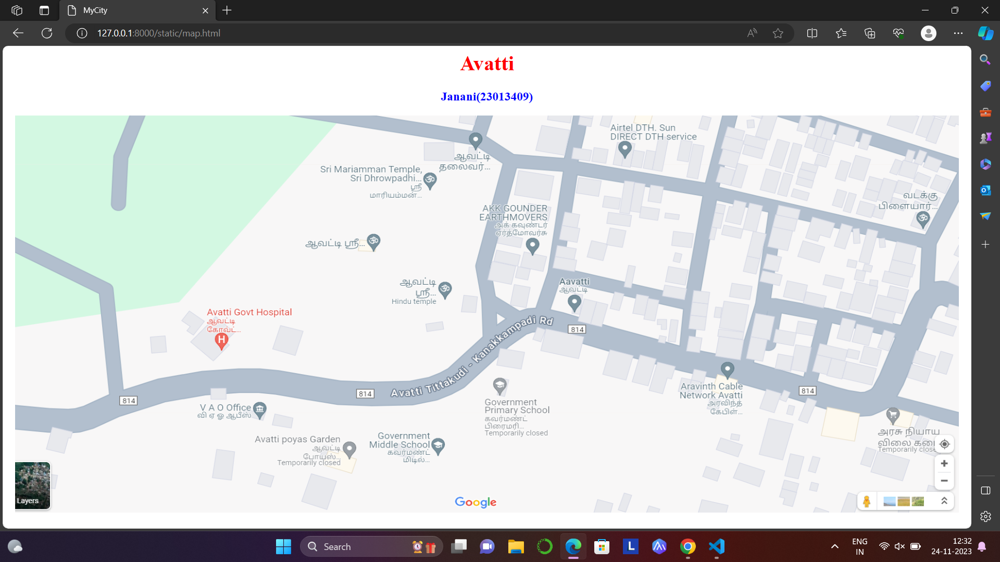
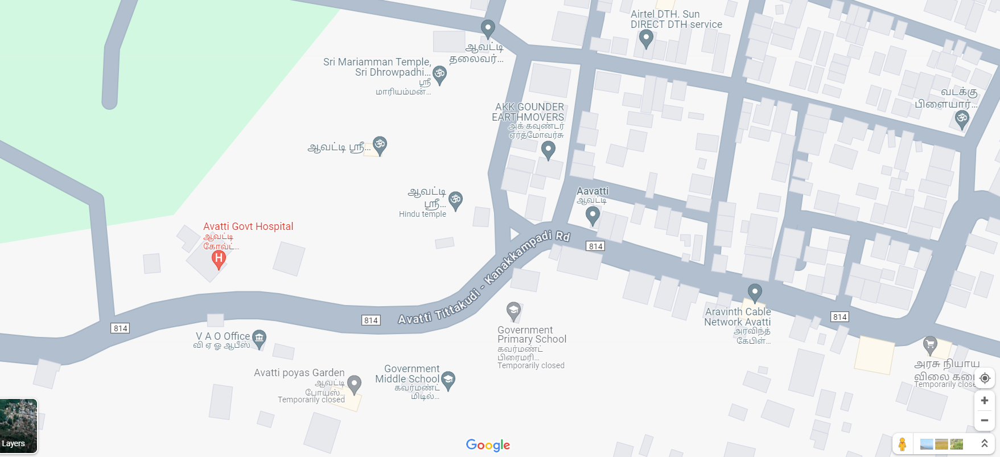
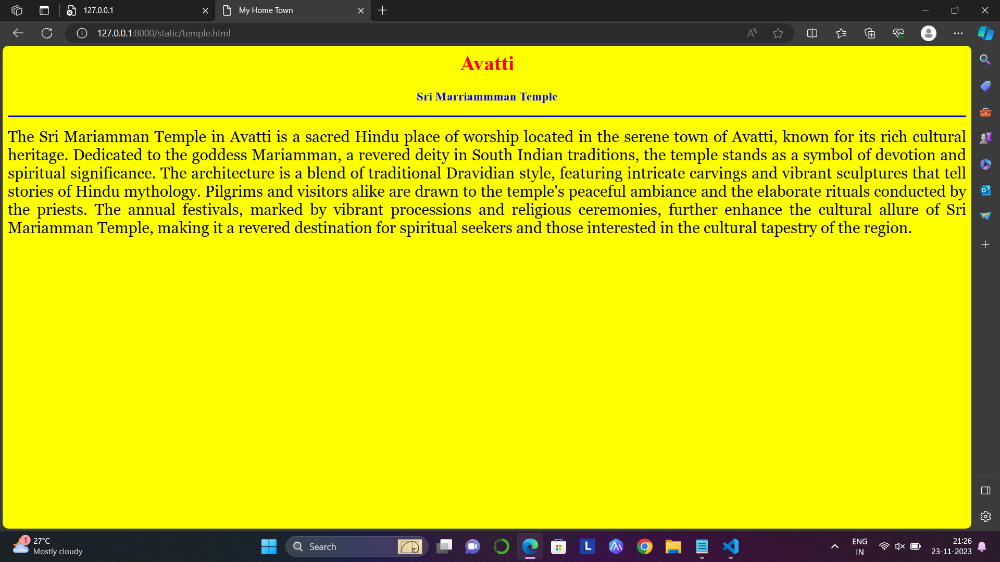
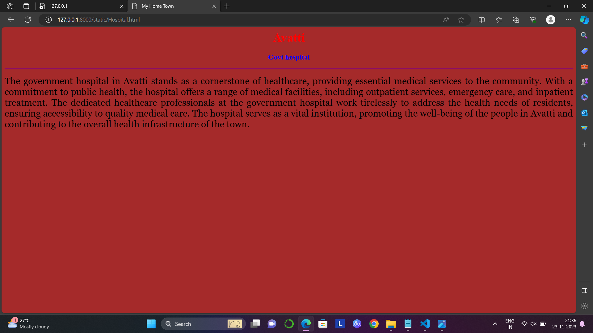
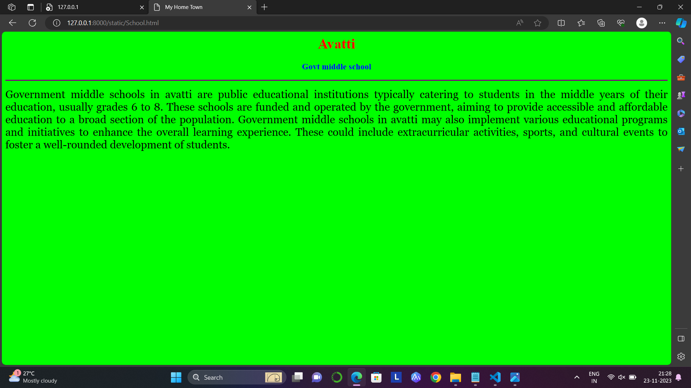

# Ex04 Places Around Me
## Date: 20.11.23

## AIM
To develop a website to display details about the places around my house.

## DESIGN STEPS

### STEP 1
Create a Django admin interface.

### STEP 2
Download your city map from Google.

### STEP 3
Using ```<map>``` tag name the map.

### STEP 4
Create clickable regions in the image using ```<area>``` tag.

### STEP 5
Write HTML programs for all the regions identified.

### STEP 6
Execute the programs and publish them.

## CODE
```
map.html

<html>
    <head>
        <title>MyCity</title>
    </head>
    <body>
        <h1 align="center">
            <font color="red"><b>Avatti</b></font>
        </h1>
        <h3 align="center">
            <font color="blue"><b>Janani(23013409)</b></font>
        </h3>
        <center>
            
            <map name="MyCity">
                <area shape="rect" coords="270,430,390,460" title="VAO office" href="VAO Office.html">
                <area shape="circle" coords="600,100,60" title="Sri Marriamman Temple" href="temple.html">
                <area shape="circle" coords="400,300,60" title="Govt Hospital" href="Hospital.html">
                <area shape="circle" coords="750,210,60" title="AKK Earthmovers" href="AKK Earthmovers.html">
                <area shape="circle" coords="600,500,60" title="Govt middle School" href="School.html">
            </map>
        </center>
    </body>
</html>

VAO Office.html

<html>
    <head>
        <title>My Home Town</title>
    </head>
        <body bgcolor="pink"
            <h1 align="center">
            <font color="red"><b>Avatti</b></font>
            </h1>
            <h3 align="center">
            <font color="yellow"><b>VAO Office</b></font>
            </h3>
            <hr size="3" color="blue">
            <p align="justify">
                <font face="Georgia" size="5">
                      The Veterans Affairs Office (VAO) located in avatti dedicated to supporting and advocating
                      for military veterans. It provides a range of services, including healthcare, disability 
                      compensation, education benefits, and housing assistance. The VAO plays a vital role in 
                      ensuring that veterans receive the care and support they deserve after their 
                      service to the nation. 
                </font>
            </p>
    </body>
</html>

temple.html

<html>
    <head>
        <title>My Home Town</title>
    </head>
        <body bgcolor="yellow">
            <h1 align="center">
            <font color="red"><b>Avatti</b></font>
            </h1>
            <h3 align="center">
            <font color="blue"><b>Sri Marriammman Temple</b></font>      
            </h3>
            <hr size="3" color="blue">
            <p align="justify">
                <font face="Georgia" size="5">
                   The Sri Mariamman Temple in Avatti is a sacred Hindu place of worship located in the serene
                   town of Avatti, known for its rich cultural heritage. Dedicated to the goddess Mariamman,
                   a revered deity in South Indian traditions, the temple stands as a symbol of devotion and
                   spiritual significance. The architecture is a blend of traditional Dravidian style, featuring
                   intricate carvings and vibrant sculptures that tell stories of Hindu mythology. Pilgrims and
                   visitors alike are drawn to the temple's peaceful ambiance and the elaborate rituals conducted
                   by the priests. The annual festivals, marked by vibrant processions and religious ceremonies,
                   further enhance the cultural allure of Sri Mariamman Temple, making it a revered destination
                   for spiritual seekers and those interested in the cultural tapestry of the region.
            </font>
            </p>
    </body>
</html>

Hospital.html

<html>
    <head>
        <title>My Home Town</title>
    </head>
        <body bgcolor="brown">
            <h1 align="center">
            <font color="red"><b>Avatti</b></font>
            </h1>
            <h3 align="center">
            <font color="blue"><b>Govt hospital</b></font>      
            </h3>
            <hr size="3" color="purple">
            <p align="justify">
                <font face="Georgia" size="5">
                     The government hospital in Avatti stands as a cornerstone of healthcare, providing essential
                     medical services to the community. With a commitment to public health, the hospital offers a 
                     range of medical facilities, including outpatient services, emergency care, and inpatient 
                     treatment. The dedicated healthcare professionals at the government hospital work tirelessly 
                     to address the health needs of residents, ensuring accessibility to quality medical care.
                     The hospital serves as a vital institution, promoting the well-being of the people in Avatti
                     and contributing to the overall health infrastructure of the town.
                </font>
            </p>
    </body>
</html>

AKK Earthmovers.html

<html>
    <head>
        <title>My Home Town</title>
    </head>
        <body bgcolor="orange">
            <h1 align="center">
            <font color="red"><b>Avatti</b></font>
            </h1>
            <h3 align="center">
            <font color="blue"><b>AKK Gounder Earthmovers </b></font>      
            </h3>
            <hr size="3" color="red">
            <p align="justify">
                <font face="Georgia" size="5">
                   AKK Earthmovers in Avatti play a crucial role in shaping the landscape and supporting various
                   construction projects. These heavy machines, equipped with powerful capabilities, are essential
                   for tasks such as excavation, grading, and site preparation. Construction sites in Avatti rely 
                   on earthmovers to efficiently move and manage materials, contributing to the development and
                   infrastructure of the town. The distinct hum of these machines echoes the progress and growth 
                   occurring in Avatti, as they navigate the terrain, transforming it to meet the evolving
                   needs of the community.
                </font>
            </p>
    </body>
</html>

School.html

<html>
    <head>
        <title>My Home Town</title>
    </head>
        <body bgcolor="lime">
            <h1 align="center">
            <font color="red"><b>Avatti</b></font>
            </h1>
            <h3 align="center">
            <font color="blue"><b>Govt middle school</b></font>      
            </h3>
            <hr size="3" color="purple">
            <p align="justify">
                <font face="Georgia" size="5">
                          Government middle schools in avatti are public educational institutions typically catering 
                       to students in the middle years of their education, usually grades 6 to 8. These schools are 
                       funded and operated by the government, aiming to provide accessible and affordable education 
                       to a broad section of the population.
			                    Government middle schools in avatti may also implement various educational programs and initiatives
                       to enhance the overall learning experience. These could include extracurricular activities, sports,
                       and cultural events to foster a well-rounded development of students.
                </font>
            </p>
    </body>
</html>

```

## OUTPUT








## RESULT
The program for implementing image maps using HTML is executed successfully.
